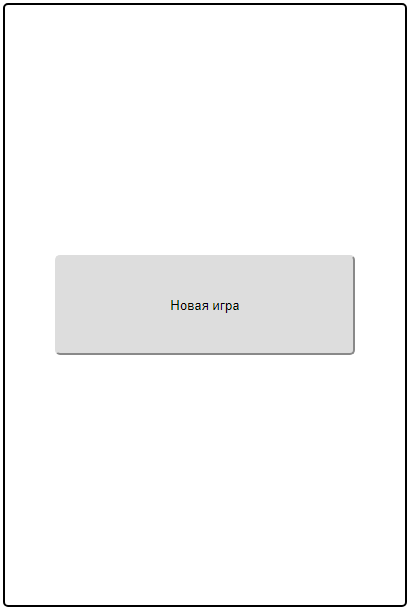
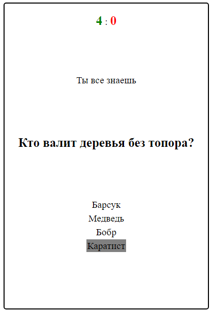
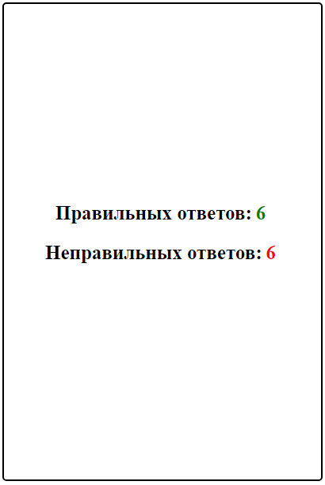

# quizGame

1. [Описание](#Описание)
2. [Изменение вопросов](#Изменение-вопросов)
    - [Системные требования](#Системные-требования)
    - [Сборка проекта](#Сборка-проекта)
    - [Сборник вопросов](#Сборник-вопросов)
3. [Скриншоты](#Скриншоты)

## <a name="Описание">Описание</a>

Викторина

## <a name="Изменение-вопросов">Изменение вопросов</a>

### <a name="Системные-требования">Системные требования</a>

- nodejs

### <a name="Сборка-проекта">Сборка проекта</a>

1. Скачать [архив](distr/quizgame.zip)
2. Разархивировать
3. В терминале перейти в папку с архивом `cd path\to\quizgame`
4. Установить gulp глобально `npm install -g gulp@4`
5. Установить проект `npm install`
6. Изменить вопросы в соответствии с пунктом [Сборник вопросов](#Сборник-вопросов)
7. Собрать проект `gulp build`
8. Собранный проект расположен в папке `app`
9. Открыть файл `app\index.html`

### <a name="Сборник-вопросов">Сборник вопросов</a>

Файл с вопросами `dev\model\questions.js` содержит список объектов вопросов, перечисленных через запятую

#### Формат объекта вопроса

```no-highlight
    {
        question: <Cтрока, содержащая вопрос>, // 'Кто охраняет лес?'
        answers: <Список вариантов ответов>, // ['Милиционер', 'Лесник', 'Пожарный', 'Дядя Вася']
        rightAnswer: <Cтрока, содержащая верный ответ>, // 'Лесник'
    }
```

## <a name="Скриншоты">Скриншоты</a>

##### Рис.1 Начало игры



##### Рис.2 Игра



##### Рис.3 Конец игры


